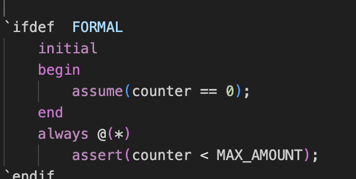

# formal-verification
 
based on slides in zipcpu:https://zipcpu.com/tutorial/class-verilog.pdf

## Dependencies
- Yosys Symbiyosys (Install oss cad suite)
- Makefile

## Basic Theory of formal verification
- Assertions define the illegal state space
- Assumptions limit the universe of all possibilities
## counter formal

- assuming counter value to be initially zero
- asserting the value of counter to be less than 22